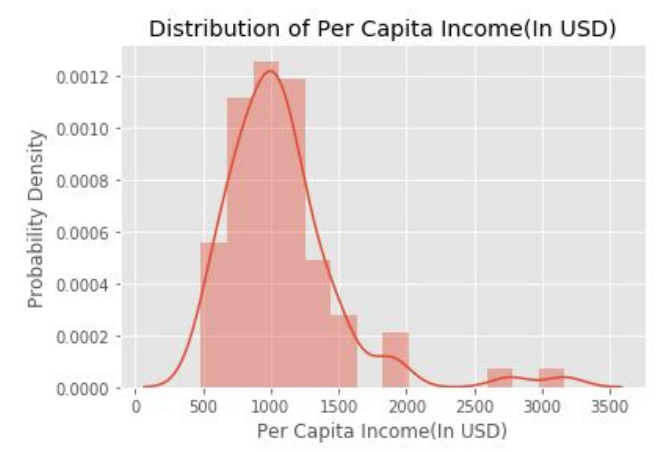

# Clustering-on-HDI-Dataset

## Abstract

Three types of clustering K-means, DBSCAN and GMM were performed on the HDI(Human
Development Index) dataset. Tuning of parameters was difficult in the case of DBSCAN so, it
detected the majority of data as outliers. K-means and GMM were found to work well. Since the
dataset was not spherical, GMM was found to work best on our dataset. The plotting of clusters
thus formed also depicted the same.

## Data Preparation

We were provided with two datasets: literacy-rates.csv which contained literacy rates for males
and females separately in columns for each district and life-expectancy-income.csv which
contained life expectancy and per capita income of all the 75 districts. When we tried to observe
if any districts were named differently in two datasets, we found all the district names in one
dataset had spaces attached to themselves. So we stripped them away. Still, there were two
districts spelled differently. We made them the same.

## Data Exploration and Analysis
We have literacy rate for males and females, life expectancy and per capita income for all the
75 districts.

Frequency distribution of Male Literacy Rate             |  Frequency distribution of Female Literacy Rate
:-------------------------:|:-------------------------:
  |  

Fig. Frequency distribution of male and female literacy rates

From this plot, we can analyze that more number of males are literate compared to females.
The range of rate for males is 50-90% while for females it is 35-80%.

On further analysis, we found that almost 75 % of males are literate while only 56% of females
are literate.

Distribution of Per Capita Income            |  Frequency distribution of Life expectancy
:-------------------------:|:-------------------------:
  |  
